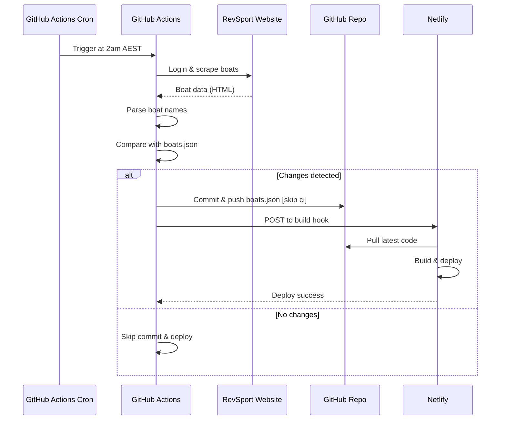

# Netlify Deployment

**Last Updated**: 2025-11-23

---

## Overview

The BoatBooking project is automatically deployed to Netlify from the GitHub repository.

**Production URL**: https://lakemacrowing.au

---

## Deployment Architecture

```
GitHub Repository (main branch)
    ↓
    ├─→ Code Changes → Netlify Build (automatic)
    └─→ boats.json Updates → Netlify Build Hook (GitHub Actions)
         ↓
    Production Site (Netlify)
```

---

## Automatic Deployment Triggers

### 1. Code Changes
**Trigger**: Any push to `main` branch (except with `[skip ci]`)
**Process**: Netlify detects the push and automatically rebuilds/deploys

### 2. Boat Data Updates
**Trigger**: GitHub Actions updates `boats.json` daily
**Process**:
1. GitHub Actions runs at 2am AEST (cron schedule)
2. Scrapes boat data from RevSport
3. Updates `boats.json` if changes detected
4. Commits with `[skip ci]` (to avoid infinite loops)
5. **Explicitly triggers Netlify build hook** via curl

---

## GitHub Secrets Required

The following secrets must be configured in GitHub repository settings:

### 1. `REVSPORT_USERNAME`
- **Purpose**: Login to RevSport to scrape boat data
- **Value**: RevSport account username
- **Used by**: `.github/workflows/update-boats.yml`

### 2. `REVSPORT_PASSWORD`
- **Purpose**: Login to RevSport to scrape boat data
- **Value**: RevSport account password
- **Used by**: `.github/workflows/update-boats.yml`

### 3. `NETLIFY_BUILD_HOOK`
- **Purpose**: Trigger Netlify deployment when boats.json updates
- **Value**: Netlify build hook URL (see setup below)
- **Used by**: `.github/workflows/update-boats.yml`
- **Format**: `https://api.netlify.com/build_hooks/XXXXXXXXXXXXXXXXXXXXX`

---

## Setting Up Netlify Build Hook

### Step 1: Get Build Hook URL from Netlify

1. Log into Netlify: https://app.netlify.com/
2. Go to your site (lakemacrowing.au)
3. Navigate to: **Site settings** → **Build & deploy** → **Build hooks**
4. Click **"Add build hook"**
5. Name: `GitHub Actions - Boat Data Update`
6. Branch to build: `main`
7. Click **"Save"**
8. Copy the generated URL (looks like: `https://api.netlify.com/build_hooks/...`)

### Step 2: Add to GitHub Secrets

1. Go to: https://github.com/UndefinedRest/LMRC-BoatBookings/settings/secrets/actions
2. Click **"New repository secret"**
3. Name: `NETLIFY_BUILD_HOOK`
4. Value: Paste the URL from Step 1
5. Click **"Add secret"**

### Step 3: Verify

1. Manually trigger the boat update workflow:
   - Go to: https://github.com/UndefinedRest/LMRC-BoatBookings/actions
   - Click "Update Boat List from RevSport"
   - Click "Run workflow"
2. Check the logs - should see "✅ Netlify deploy triggered"
3. Check Netlify deploys page - should see a new build started

---

## How It Works

### Daily Boat Data Sync



### Why `[skip ci]` + Build Hook?

**Problem**: Without `[skip ci]`, pushing boats.json would trigger Netlify, which might trigger the GitHub Action again, creating an infinite loop.

**Solution**:
- Use `[skip ci]` to prevent automatic Netlify deploys
- Explicitly trigger Netlify via build hook instead
- This gives us control: deploy only when boats.json actually changes

---

## Deployment Status

### Check Deployment Status

**Netlify Deploys Page**: https://app.netlify.com/sites/YOUR_SITE/deploys

**GitHub Actions**: https://github.com/UndefinedRest/LMRC-BoatBookings/actions

### Expected Schedule

| Time (AEST) | Action | Duration |
|-------------|--------|----------|
| 2:00 AM | GitHub Actions starts | - |
| 2:01 AM | RevSport scraped | ~30 sec |
| 2:02 AM | boats.json committed | ~5 sec |
| 2:02 AM | Netlify deploy triggered | ~1 sec |
| 2:02 AM | Netlify build starts | - |
| 2:04 AM | Netlify deploy complete | ~2 min |

**Total time**: ~4-5 minutes from trigger to live

---

## Troubleshooting

### boats.json Updated but Site Not Deployed

**Symptom**: boats.json shows correct data in GitHub, but production site has old data

**Cause**: Netlify build hook not triggered

**Check**:
1. Verify `NETLIFY_BUILD_HOOK` secret exists in GitHub
2. Check GitHub Actions logs for "Netlify deploy triggered" message
3. Check Netlify deploys page for recent builds

**Fix**:
1. Add/update `NETLIFY_BUILD_HOOK` secret (see setup above)
2. Manually trigger deployment from Netlify dashboard
3. Or manually trigger GitHub Actions workflow

### Manual Deployment

If you need to deploy immediately:

**Option 1: Via Netlify Dashboard**
1. Log into Netlify
2. Go to Deploys
3. Click "Trigger deploy" → "Deploy site"

**Option 2: Via GitHub Actions**
1. Go to: https://github.com/UndefinedRest/LMRC-BoatBookings/actions
2. Click "Update Boat List from RevSport"
3. Click "Run workflow"
4. This will scrape fresh data AND trigger deployment

---

## Deployment Configuration

### Netlify Build Settings

**Build command**: None (static site, no build needed)
**Publish directory**: `.` (root directory)
**Production branch**: `main`

### Files Deployed

```
BoatBooking/
├── book-a-boat.html     ← Main booking page
├── index.html           ← Landing/redirect page
├── boats.json           ← Boat data (updated daily)
├── noticeboard.html     ← Noticeboard display (if used)
└── _redirects           ← Netlify redirect rules (if exists)
```

---

## Monitoring

### GitHub Actions Workflow Status

**URL**: https://github.com/UndefinedRest/LMRC-BoatBookings/actions

**Success criteria**:
- ✅ Workflow runs daily at 2am AEST
- ✅ "boats.json updated and committed" message
- ✅ "Netlify deploy triggered" message
- ✅ No failed workflow runs

### Netlify Deploy Status

**URL**: https://app.netlify.com/sites/YOUR_SITE/deploys

**Success criteria**:
- ✅ Deploy completes within 5 minutes
- ✅ "Published" status (green)
- ✅ No failed deploys

### Production Site Verification

**Check**: https://lakemacrowing.au/boats.json

**Expected**:
- `lastUpdated` timestamp should be within 24 hours
- Boat data should match RevSport

---

## Related Documentation

- **[HOSTING.md](HOSTING.md)** - Original Firebase hosting analysis (for reference)
- **[FEATURE_ROADMAP.md](FEATURE_ROADMAP.md)** - Feature planning and status
- **[DAMAGE_REPORTING_PROPOSAL.md](DAMAGE_REPORTING_PROPOSAL.md)** - Boat damage reporting feature

---

## Document History

| Version | Date | Author | Changes |
|---------|------|--------|---------|
| 1.0 | 2025-11-23 | Claude AI | Initial documentation - Netlify build hook integration |

---

**Status**: ✅ Active - Netlify deployment with automated boat data sync
